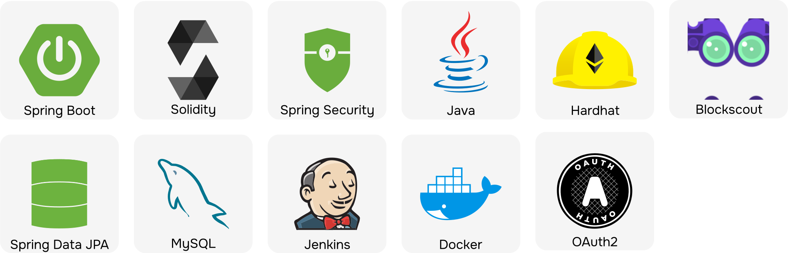

## 프로젝트 개요

**서비스 소개**

```
블록체인 기술을 활용하여 기부금 사용의 투명성을 보장하며,
중고거래 연계, 캠페인 등 다양한 방법으로 후원에 참여할 수 있는 기부 플랫폼입니다.

- 중고거래를 통해 거래 성사시 판매자가 판매 금액의 일부를 원하는 재단에 기부할 수 있습니다.
- 모의 금융망 API를 활용한 계좌 연동 기능이 존재합니다. (포인트 충전 및 출금, 결제 비밀번호 등)
- 여러 가지 방식으로 기부를 할 수 있습니다. 일시후원/정기후원, 또 재단이 진행하는 캠페인을 선택해서 후원할 수 있습니다.
- 캠페인 후원에 참여할 경우, 응원 메시지를 남길 수 있으며 메시지는 크리스마스 트리에 장식됩니다.
```
<details>
  <summary>🖼️ 주요 기능 스크린샷</summary>
  
  ### 💳 계좌 연동을 통한 간편한 기부
  
  
  
  ### 🛍️ 물품 판매 수익금의 일부 기부
  
  
  
  ### 🫧 기부 내역의 투명한 공유
  
  
  
  ### 🎄 캠페인 개설 및 트리 응원 메세지
  
  
  
  

</details>

**프로젝트 기간**

2024년 10월 14일 ~ 2024년 11월 19일

<a href="https://separated-drifter-e42.notion.site/GiveTree-1b809bd563a48052b59dc6bd75a6ac33" target="_blank">❗ **개인적으로 개발하면서 고민했던 점과 트러블 슈팅**</a>

<details>
  <summary>🖼 본인 담당 기능 시연 영상</summary>
  
  ### 로그인 및 회원가입
  https://github.com/user-attachments/assets/c7acc7c0-a9a0-4cfc-8ed4-5a0e083f9699
  
  ### 거래 관련 기능 (게시글, 검색, 채팅)
  https://github.com/user-attachments/assets/b4a7e289-c15d-4162-b1c2-ce3e27a95698
</details>

## 🎯 주요 기능

- 로그인 및 회원가입 **(본인 담당)**
  - 후원자, 재단회원 두 종류의 회원이 존재합니다.
  - 재단회원은 추가적인 정보를 입력해야 합니다. (재단 소개, 대표 이미지 등)
- 중고 거래 **(본인 담당)**
  - 중고 거래글 작성 및 조회
  - 중고 물품 판매자/구매자 간의 1:1 채팅
  - 거래 완료시 FCM을 활용한 백그라운드 알림
- 재단 후원
  - 원하는 기부 재단을 선택해 후원할 수 있습니다.
- 캠페인 후원
  - 특정 재단이 진행하는 캠페인에 후원에 할 수 있습니다.
  - 목표 모금액과 캠페인 기간이 존재합니다.
- 계좌 입출금
  - 중고 거래, 후원 등 서비스에 이용에 필요한 포인트를 충전
  - 모의 금융망 API를 활용했습니다.
- 크리스마스 트리
  - 캠페인 후원을 할 경우 후원 메시지를 남길 수 있으며, 메시지는 해당 캠페인의 트리에 장식됩니다.
 
## 🧑‍🤝‍🧑 팀원 및 담당 역할

### 프론트엔드

| **이름**   | **업무**                             |
| ---------- | ------------------------------------ |
| **조소연** | 재단, 계좌, 결제                     |
| **윤지원** | 캠페인, 후원, 트리                   |
| **김다운** | 로그인 및 회원가입, 거래, 채팅, 알림 |

### 백엔드

| **이름**   | **업무**                      |
| ---------- | ----------------------------- |
| **권용진** | CI/CD, 인증, 인가, 거래, 알림 |
| **이유승** | 블록체인, 금융, 후원          |
| **신재민** | 채팅, 재단, 캠페인            |

## 🛠️ 기술 스택

**[FE]**


**[BE]**



<details>
  <summary>🏗️ 아키텍처</summary>
  
  
</details>
